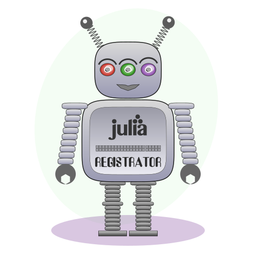

# Registrator

Registrator is a GitHub app that automates creation of registration pull requests for your julia packages to the [General](https://github.com/JuliaRegistries/General) registry. Install the app by clicking on the button below:

#### How to use

1) Using a Pull Request:

Create a pull request on the package repo with your project file changes. Add `` @JuliaRegistrator `register()` `` as the content body of the pull request if you are a collaboarator on the package repository. If you are not a collaborator ask someone who is to comment `` @JuliaRegistrator `register()` `` on the Pull Request. This will make Registrator add a pull request to General by looking at your pull request branch.

2) Using an issue:

Raise an issue in the package you wish to register. Add `` @JuliaRegistrator `register()` `` somewhere in the content of the issue if you are a collaborator to trigger Registrator. If you are not a collaborator ask someone who is to comment `` @JuliaRegistrator `register()` `` on the issue. This will make Registrator add a pull request to General with the appropriate changes. Registrator will look for the project file in the master branch by default. To use a custom branch comment with `` @JuliaRegistrator `register(name-of-your-branch)` ``.

3) Using a commit comment:

On GitHub click on a commit that you wish to register. In the comment section below say `` @JuliaRegistrator `register()` ``. Note that you must be a collaborator in order to do this.

#### Approving pull requests on the registry

This step has to be performed by the maintainer of the registry, for public packages the maintainer of the [General](https://github.com/JuliaRegistries/General) registry. Comment with `` @JuliaRegistrator `approved()` `` on a pull request on the registry to approve it. This will make Registrator to merge the pull request on the package (if any) and create a new tag and release. The approved PR will also be merged after that.

#### Permissions and subscribed events for the app

You will need read-only permission for: Repository contents, Repository Metadata

You will need read & write permission for: Issues, Pull Requests, Commit Statuses

You will need to subscribe to the following events: Issue comment and commit comment

#### How to run

See the `image` directory on how to build the docker image.

#### For private packages and registries

* Same [install](https://github.com/apps/registratortest/installations/new) step as above.
* Add @JuliaRegistrator as a collaborator to your private Registry
